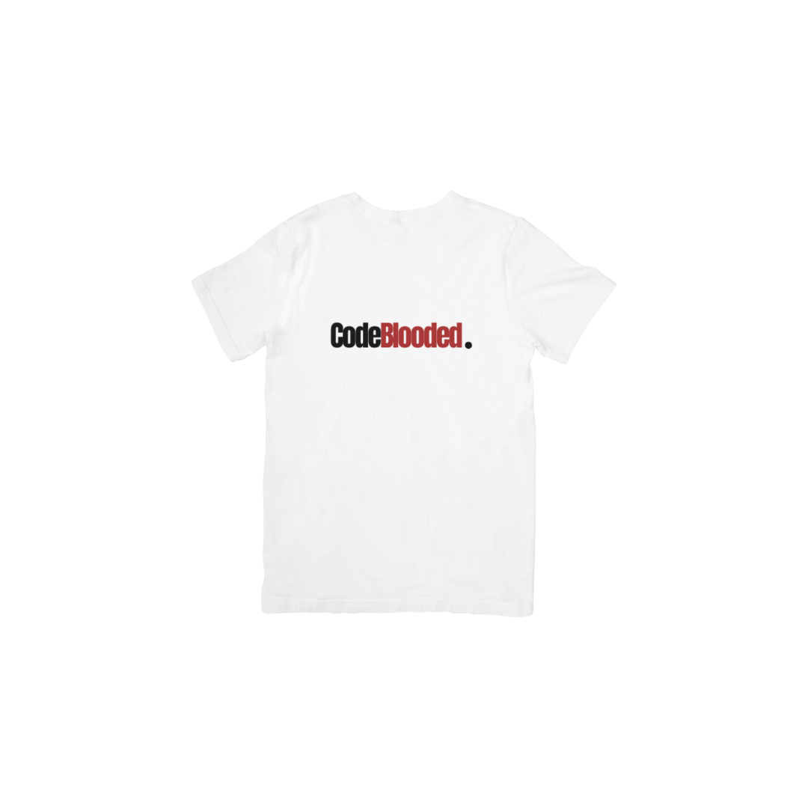

 3 - MERN Stack Single-Page Application

## Description

This project represents an interactive MERN Stack Single-Page Application designed to showcase collaborative skills and coding abilities in the context of a scalable, user-focused platform. It fulfills the requirements of a real-world problem-solving application using VS Code editor where Apollo client, React-Bootstrap, graphql, React, and Vitest were used to synthesize the framework, database, and libraries used. Once complete, the project was uploaded to a Github repository.
Our team chose to create an eCommerce website that allows users to select from various items to purchase, place them in a cart, and the proceed to finalize their order. In order to navigate to the cart the user must be securely logged in. The completed application will illustrate to employers the team’s collaborative skills and coding abilities in the context of a scalable, user-focused MERN. 

## Technologies Used

- React
- GraphQL
- Node.js
- Express.js
- MongoDB
- Mongoose ODM
- Javascript
- JSON Web Token (JWT)
- Render (for deployment)
- CSS (styled-components, Emotion, or other)
- React Bootstrap

## Project Requirements

Our group will adhere to the requirements set forth to us by our instructor. These requirements include use of everything we have learned throughout this course to create a MERN stack single-page application. It must work with real-world data to solve a real-world challenge. It’s focus is on data and user demand. This project will provide the team with the best opportunity to demonstrate our problem-solving skills, which employers will want to see during interviews. Our project must also fulfill the following requirements:

* Use of React for the front end.

* Use of GraphQL with a Node.js and Express.js server.

* Use of MongoDB and the Mongoose ODM for the database.

* Use of queries and mutations for retrieving, adding, updating, and deleting data.

* Be deployed using Render.

* Have a polished UI.

* Be responsive.

* Be interactive.

* Must include authentication.

* Must protect sensitive API key information on the server.

* Must include a clean repository that meets quality coding standards (file structure, naming conventions, best practices for class and id naming conventions, indentation, high-quality comments, etc.).

* Must include a high-quality README (with unique name, description, technologies used, screenshot, and link to deployed application).

## Presentation

A Powerpoint presentation to the instructors and class will be given on the project due date.

### Elevator Pitch

Great to meet you! Our team is cleverly called “Code-Blooded.”  We are recent graduates of the Denver University Coding Bootcamp where we have expertise in designing and creating complex websites through the use of various coding tools. We are versatile in our abilities and would be able to create a wide range of projects that will surely meet your needs. Please contact us with your questions and an opportunity for us to demonstrate our abilities.

### Concept

A full stack project designed to satisfy the requirement of incorporating Apollo client, Bootstrap, Graphql, React, and Vitest into its creation. The project chosen is an eCommerce website which provides the user with options to select various items from a shopping page and place them into a cart. Once items are placed into the cart and the user would like to proceed with the purchase, he/she is first securely logged in, and then directed to the payment window. The following are photos of the website on various pages.

Homepage, noting drop down menu. Also, the “CodeBlooded” logo serves as a link that takes the user back to the homepage:

Bottom half of homepage, noting links to Instagram, Twitter, and Github:
 

Following the selection of “Login” on homepage:

 

Following login, note the “Login” button is now “Logout”:

 

Following selection of “Signup” on the homepage:

 

Following selection of a product from homescreen drop down menu:

### Process

Open the terminal, in the command line use the following:
1.	npm i (installs all necessary files)
2.	npm run seed (seed the database)
3.	Npm start (start the server)
4.	Open Render
5.	Run the program
6.	Visualize the website

### Contributors

https://github.com/amartin02

https://github.com/vicduar

http://github.com/chrisjames1724

http://github.com/giordior

https://github.com/lavendarqueen 

### Directions for Future Development

1. Incorporate STRIPE into the project as the payment processing platform.
2. Expand number of store items.

## Deployment

Link to Deployed Webpage:

- https://code-blooded-repo-1.onrender.com/ 

- Link to Github Repo:

https://github.com/teamName-Code-Blooded/Code-blooded-repo.git

## Project Presentation

Presented to the class on the due date. The following are screenshots of the webpages:

## Credits

Machock, B. (2024, May 7-13). Zoom meeting at www.zoom.us. Denver University Bootcamp.

Miller, C. (2024, May 7-13). Zoom meeting at www.zoom.us. Denver University Bootcamp.

## License

This project uses the MIT license.

